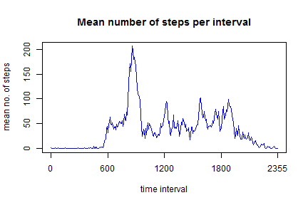
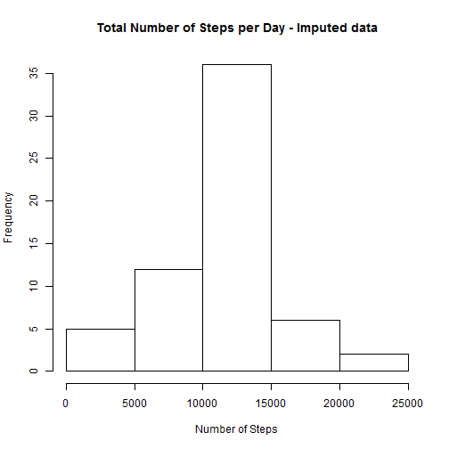
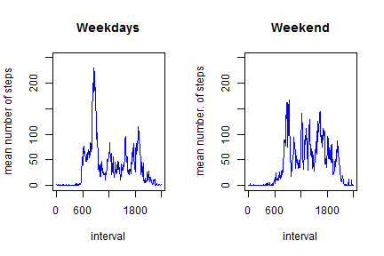

# Coursera Data Science Specialization - Reproducible Research

# Peer Assigment 1:

===========================================

# Data
The data for this assignment can be downloaded from the course web site:
Dataset: Activity monitoring data (https://d396qusza40orc.cloudfront.net/repdata%2Fdata%2Factivity.zip) [52K]

The variables included in this dataset are:

 - steps: Number of steps taking in a 5-minute interval (missing values are coded as NA )   
 - date: The date on which the measurement was taken in YYYY-MM-DD format  
 - interval: Identifier for the 5-minute interval in which measurement was taken  
 
The dataset is stored in a comma-separated-value (CSV) file and there are a total of 17,568 observations in
this dataset.

The original questions for this assignment are in bold font below. 


# Loading and preprocessing the data    
<br>
Now, we load the data, and convert the date column to a date variable.  

```r
data <- read.table("./activity.csv", sep =",", header = TRUE)
# convert the data column to a date class
data$date <- as.Date(data$date)
```

<br>
Let's look at the first 5 rows so we know how the data looks like:

```r
head(data, n=5)
```

```
##   steps       date interval
## 1    NA 2012-10-01        0
## 2    NA 2012-10-01        5
## 3    NA 2012-10-01       10
## 4    NA 2012-10-01       15
## 5    NA 2012-10-01       20
```

# What is mean total number of steps taken per day?
<br>
**Calculate the total number of steps taken per day**  

To answer this question, we use the *aggregate* function to generate a data frame with the total number of steps taken every day.  

```r
totalstepsperday <- aggregate(data$steps,by=list(data$date),FUN=sum)
# to tidy things up, we rename the columns of the data frame that we have generated
names(totalstepsperday) <- c("date", "total_steps")
```

<br>
**Make a histogram of the total number of steps taken each day**  

To answer this question, we use R's *hist* function. 

```r
hist(totalstepsperday$total_steps, main = "Total Number of Steps per Day", xlab = "Number of Steps")
```

 

<br>
**Calculate and report the mean and median of the total number of steps taken per day**

Let's use R's *mean* and *median* function for this. Alternatively, we could also use the *summary* function.

Mean:

```r
mean(totalstepsperday$total_steps, na.rm = TRUE)
```

```
## [1] 10766.19
```
Median:

```r
median(totalstepsperday$total_steps, na.rm = TRUE)
```

```
## [1] 10765
```


# What is the average daily activity pattern?  

<br>
**Make a time series plot (i.e. type = "l" ) of the 5-minute interval (x-axis) and the average number of steps taken, averaged across all days (y-axis)**


First, let's compute the average number of steps for each 5-minute interval in the data. 

```r
# Let's use the aggregate function to compute the mean of the number of steps for every interval in the data 
stepsEachInterval <- aggregate(data$steps, by = list(data$interval), FUN = mean, na.rm = TRUE)
# to tidy things up, we rename the columns of the data frame that we have generated
names(stepsEachInterval) <- c("interval", "mean_steps")
```

Now, let's plot the mean number of steps per interval using R's base plotting system.

```r
# Base plot without x axis
plot(stepsEachInterval$mean_steps, xlab = "time interval", ylab = "mean no. of steps", main ="Mean number of steps per interval", type = "l", xaxt = "n", col="blue", )
# Add an x axis
labels <- c(0, 600, 1200, 1800, 2355)
at <- sapply(labels, function(z) which(stepsEachInterval$interval == z))
axis(1, at = at, labels = labels)
```

 


<br>
**Which 5-minute interval, on average across all the days in the dataset, contains the maximum number
of steps?**

The following code calculates and prints the interval for which the average number of steps is the highest. 

```r
stepsEachInterval$interval[which.max(stepsEachInterval$mean_steps)]
```

```
## [1] 835
```


Looking at the calculated result, the mean number of steps is highest in the interval starting at 8:35 in the morning.


# Imputing missing values

Note that there are a number of days/intervals where there are missing values (coded as NA ). The presence of missing days may introduce bias into some calculations or summaries of the data.
<br>
**Calculate and report the total number of missing values in the dataset (i.e. the total number of rows with NAs):** 


Let's first compute the number of NAs in the original data set:

```r
sum(is.na(data$steps))
```

```
## [1] 2304
```

As a preliminary step, we produce a version of the data set that contains only the complete data.

```r
datComplete <- subset(data, !is.na(steps))
```


<br>
**Devise a strategy for filling in all of the missing values in the dataset. The strategy does not need to be
sophisticated.** 

My imputation strategy is not very sophisticated, but should suffice for the purpose of this assignment. My imputation approach is to use the mean number of steps for the five-minute interval of the missing observation.


<br>
**Create a new dataset that is equal to the original dataset but with the missing data filled in.**


```r
# Copy the data frame to which the imputed values will be added
imputedData <- data
# All unique intervals that occur in the sample
ints <- sort(unique(datComplete$interval))
# Loop over intervals
for (ii in ints){
  imputedData$steps[is.na(data$steps) & (data$interval == ii)] <- subset(stepsEachInterval, interval == ii)$mean_steps
}
```


<br>
**Make a histogram of the total number of steps taken each day and Calculate and report the mean and
median total number of steps taken per day. Do these values differ from the estimates from the first part
of the assignment? What is the impact of imputing missing data on the estimates of the total daily
number of steps?**


First, let's compute the total number of steps per day for the imputed dataset and show the summary statistics which contain the mean and the median steps taken per day. 


```r
# Sum of steps for every day in the imputed data 
stepsPerDayImputed <- aggregate(imputedData$steps, by = list(imputedData$date), FUN = sum)
# Rename the columns of the data frame generated
names(stepsPerDayImputed) <- c("date", "total_Steps")
# make histogram of the total number of steps taken each day
hist(stepsPerDayImputed$total_Steps, main = "Total Number of Steps per Day - Imputed data", xlab = "Number of Steps")
```

 

```r
# Show summary stats
summary(stepsPerDayImputed$total_Steps)
```

```
##    Min. 1st Qu.  Median    Mean 3rd Qu.    Max. 
##      41    9819   10770   10770   12810   21190
```

The resulting data shows that the values of the imputed data set slightly differ from the estimates from the first part of the assignment. 

The summary statistics including the mean and median total steps from the first part of the assignment are:


```r
summary(totalstepsperday$total_steps)
```

```
##    Min. 1st Qu.  Median    Mean 3rd Qu.    Max.    NA's 
##      41    8841   10760   10770   13290   21190       8
```


For the NA-imputed data set, the summary statistics including the mean and median are:

```r
summary(stepsPerDayImputed$total_Steps)
```

```
##    Min. 1st Qu.  Median    Mean 3rd Qu.    Max. 
##      41    9819   10770   10770   12810   21190
```

The impact of imputing missing data on the estimates of the total daily number of steps is zero for the mean value and 0.11% for the median value :


```r
impact_mean <- mean(totalstepsperday$total_steps, na.rm = TRUE)/ mean(stepsPerDayImputed$total_Steps)
impact_mean
```

```
## [1] 1
```

```r
impact_median <- median(totalstepsperday$total_steps, na.rm = TRUE)/ median(stepsPerDayImputed$total_Steps)
impact_median
```

```
## [1] 0.9998896
```


# Are there differences in activity patterns between weekdays and weekends?

<br>
**Create a new factor variable in the dataset with two levels - "weekday" and "weekend" indicating
whether a given date is a weekday or weekend day.**


First, let's create a new factor variable in the dataset using the *weekdays* function.

```r
# Create variable
imputedData$weekend <- as.factor(weekdays(imputedData$date) %in% c("Saturday", "Sunday"))
# let's look at the first 3 rows of the resulting data
head(imputedData, 3)
```

```
##       steps       date interval weekend
## 1 1.7169811 2012-10-01        0   FALSE
## 2 0.3396226 2012-10-01        5   FALSE
## 3 0.1320755 2012-10-01       10   FALSE
```


Now, we calculate the mean number of steps for each interval, for both weekdays and weekends. We use the *aggregate* function again.


```r
stepsPerInterval2 <- aggregate(imputedData$steps, by = list(imputedData$interval, imputedData$weekend), mean)
# to clean things up, we rename the columns of data frame generated
names(stepsPerInterval2) <- c("interval", "weekend", "mean_steps")
```


<br>
**Make a panel plot containing a time series plot (i.e. type = "l" ) of the 5-minute interval (x-axis) and
the average number of steps taken, averaged across all weekday days or weekend days (y-axis).**


Now, we generate the plot, using the base plotting system. 

```r
par(mfrow = c(1, 2))
# First plot
plot(subset(stepsPerInterval2, weekend == FALSE)$mean_steps, xlab = "interval", ylab = "mean number of steps", main ="Weekdays", type = "l", col="blue", xaxt = "n", ylim = c(0, 250))
axis(1, at = at, labels = labels)
plot(subset(stepsPerInterval2, weekend == TRUE)$mean_steps, xlab = "interval", ylab = "mean number. of steps", main ="Weekend", type = "l", col="blue", xaxt = "n", ylim = c(0, 250))
axis(1, at = at, labels = labels)
```

 

